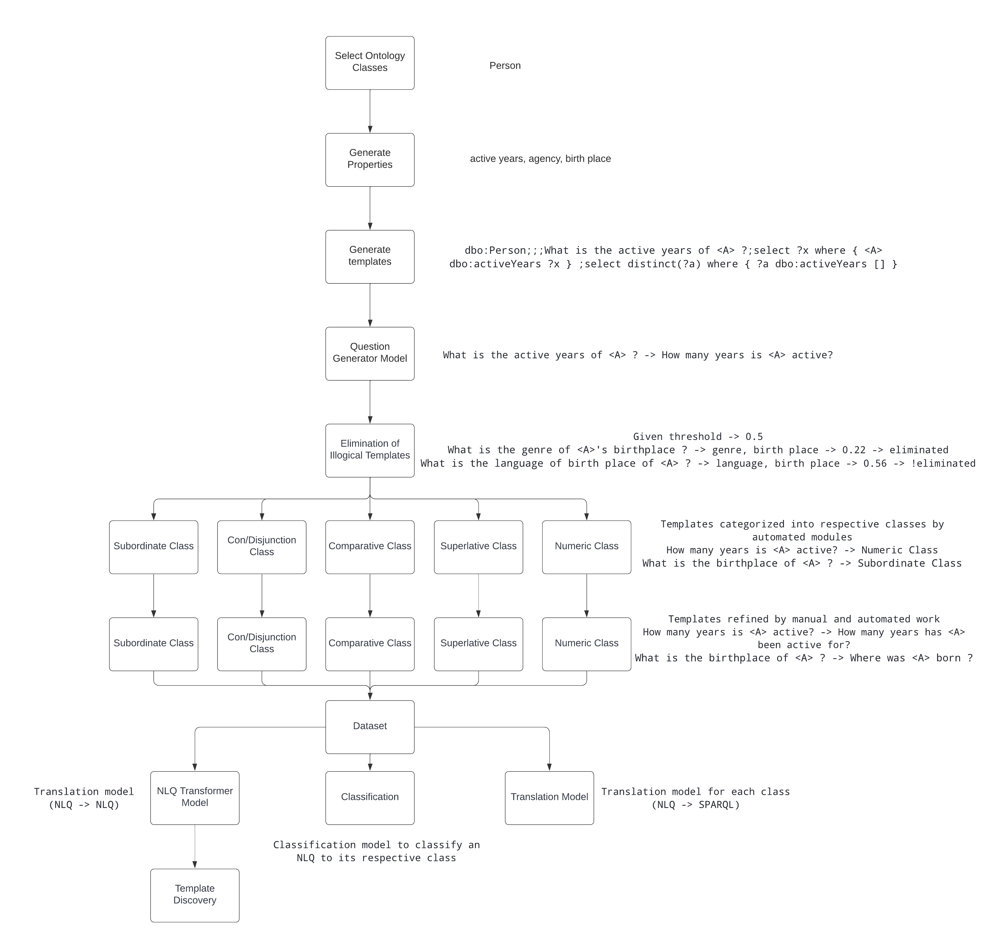

# Week 1

---

## Description

A simple description of my project training pipeline is shown in the figure below:



In this week, I focused on creating metrics for benchmark 1 and benchmark 2. The metrics used for evaluation are the bleu score and the f1-score. 

Benchmark 1 utilizes the calculation of f1-score between the answers of QALD sparql queries for its respective nlq (natural language question) and the answers of the model's prediction. In order calculate the f1-score, first the qald-9-train-multilingual.json file is parsed to get all required answers from a very detailed file. Secondly, as the nspm model predicts sparql queries in an encoded form, they needed to be decoded first and then using the DBpedia sparql endpoint, the results are fetched. Now that, we have both the results, we calculate the f1-score. For qald, bleu score is not calculated because the construction of sparql queries for qald is different from ours.


Benchmark 2 utilizes the calculation of the bleu score between the true sparql queries and the model's predicted sparql queries for the dataset that is to be generated in later weeks. 


The ontology classes chosen to create the dataset are Person, and Work as these classes are very large i.e they contain a lot of properties. In general, there are a lot of ontologies in the knowledge graph. The templates created for these ontology classes are composite in nature i.e the template contains 1 or 2 properties. An example of a single template and a composite template is shown below:

```
dbo:Person;;;What is the active years of <A> ?;select ?x where { <A> dbo:activeYears ?x } ;select distinct(?a) where { ?a dbo:activeYears [] }
```
```
dbo:Work;;;What is the manufacturer of award of <A> ?;select ?x where { <A> dbo:award ?x1 . ?x1 dbo:manufacturer ?x } ;select distinct(?a) where { ?a dbo:award [] . ?a dbo:award ?x1 . ?x1 dbo:manufacturer ?x } 
```

An analysis of the QALD dataset was performed to find out representative for each class i.e subordinate, con/disjunctions, comparative, superlative, and numeric. The templates generated will be transformed to these representatives both using automated functions and manually (not exactly like the representative but somewhat similar) at a very later stage i.e after the Question Generator module. 

## Next weeks plan:

1. Question Generator module: A module which receives a template as input and outputs a comparatively more efficient natural language question. Generate the new dataset using the question generation model for the same ontology classes.

2. Eliminator module: Implementing a sentence transformer model which takes a sentence as input and checks whether a sentence is logical or not. Eliminating templates that fall below a certain threshold.

3. Running benchmark 1.

4. Classifying the templates of the dataset into its respective classes using automated modules and functions to create the final dataset.

