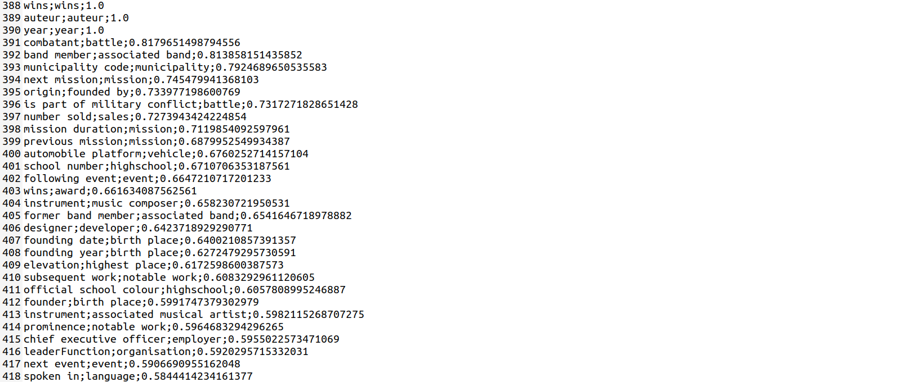
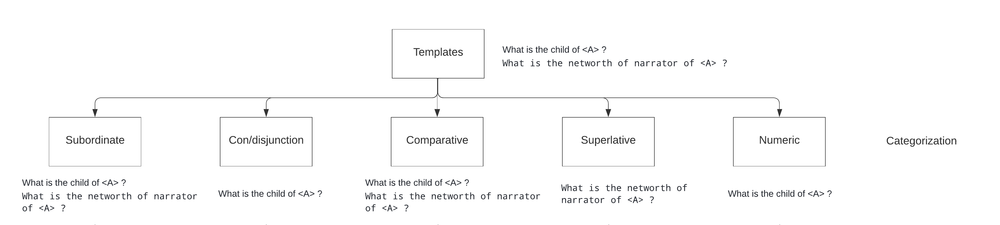
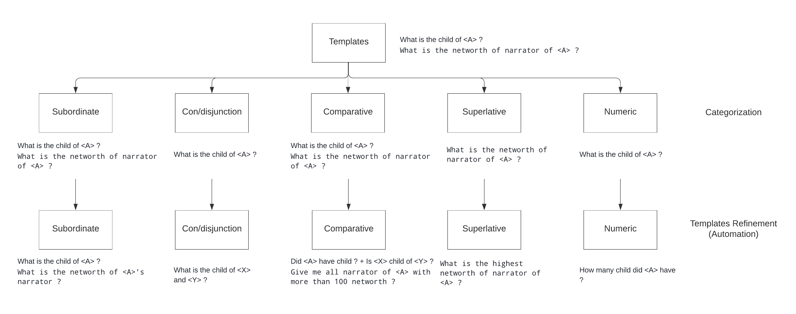

# Week 2

---

## Question Generation Model

To make the templates more natural and varied with the same semantics, the idea is to pass the template in a differently structured manner to a question generator model which predicts the right question automatically. It is just another technique of paraphrasing the template. As the question generation model requires both the question content as well as the answer in the input, the template is structured to get the desired output question. For example, for the template ```What is the active years of <A> ?```, the structured content will be ```the active years of ABC is Q``` and so the output will be ```How many years is ABC active?``` where then ABC is replaced by the placeholder \<A>. Some of the transformations are listed below:

<div class="code-example" markdown="1">

| template        | QGen template   | 
|:-------------|:------------------|
| What is the active years of \<A> ?          | How many years is \<A> active ? |
| What is the networth of \<A> ? | What is \<A>'s net worth ?   |
| What is the genre of birth place of \<A> ?           | What is the genre of \<A>'s birthplace ?      |
| What is the alma mater of \<A> ?           | What is the alma mater of \<A> ? | 
| Who is the author of anthem of \<A> ?           | What is the name of the \<A> anthem? | 

</div>

A sample of the template file generated is shown below:
```
dbo:Person;;;What is the active years of <A> ?;select ?x where { <A> dbo:activeYears ?x } ;select distinct(?a) where { ?a dbo:activeYears [] } ;How many years is ABC active?;active years;active years;Original
```
```
dbo:Work;;;Who is the author of anthem of <A> ?;select ?x where { <A> dbo:anthem ?x1 . ?x1 dbo:author ?x } ;select distinct(?a) where { ?a dbo:anthem [] . ?a dbo:anthem ?x1 . ?x1 dbo:author ?x } ;What is the name of the ABC anthem?;author;anthem;Original
```

## Eliminator Module

Before passing the templates to the next section, the idea is to eliminate certain templates which are not logical. The type of questions that sometimes are illogical is mostly composite i.e they have 2 properties in a sentence. To check whether they are logical or not, the semantic similarity of both the properties is found using an stsb-roberta-large sentence transformer model which uses ROBERTA-large as a base model. A score_data file is generated which is sorted in descending order for analysis. Upon performing the analysis, a threshold is set, and all templates below the threshold are eliminated. The result of the eliminator module is the final templates that are used for categorization. A sample of score_data file is shown below:



As some templates generated from the QGen model are not accurate such as the last one shown in the above table, a simple property check is performed on the generated templates to check whether they contain the property or not. If the template passes the check then QGen generated template is considered and "QGen" is added to the line as shown below else the QGen generated template is discarded and the original template is used. Giving a little flexibility to the model, the lemmatization of the property words is also checked, incase if the generated template doesn't contain the exact property words. For example, the second example above, doesn't contain 'author' property hence the original template is used below.

A sample of the final template file generated is shown below:
```
dbo:Person;;;How many years is <A> active ?;select ?x where { <A> dbo:activeYears ?x } ;select distinct(?a) where { ?a dbo:activeYears [] } ;active years;active years;QGen
```
```
dbo:Work;;;Who is the author of anthem of <A> ?;select ?x where { <A> dbo:anthem ?x1 . ?x1 dbo:author ?x } ;select distinct(?a) where { ?a dbo:anthem [] . ?a dbo:anthem ?x1 . ?x1 dbo:author ?x } ;author;anthem;Original
```

## Benchmark 1
<br>
In Progress

## Categorization of templates (Automation)



The final templates generated after elimination are categorized into 5 classes - subordinate, con/disjunction, comparative(+boolean), superlative, and numeric using basic automated modules and functionalities. Upon initial categorization, classes may have templates that overlap but later these templates are transformed to make them class-specific. For example, a template `What is the child of <A> ?` will be transformed to `How many child did <A> have ?` in numeric class and to `Did <A> have child ?` in comparative class. Let's look in detail at how templates are categorized:

1. Subordinate: All the simple and composite templates are a part of this class. For example, `What is the alma mater of <A> ?` is a part of the subordinate class.

2. Con/disjunction: All the simple templates are included in this class. As the transformed templates of this class will contain 2 entities i.e `What is the child of <X> and <Y> ?`, the composite templates were becoming too complex hence they were not included.

3. Comparative: All simple templates and only composite templates that contain a quantitative secondary property or a "number" keyword will be included. A quantitative property is a property whose range value is of numeric type i.e xsd:integer, xsd:float, xsd:nonNegativeInteger, etc. For example, `What is the population total of birth place of <A> ?` will be included as "population total" is a quantitative secondary property with range value xsd:nonNegativeInteger. 

4. Superlative: Only composite templates having a quantitative secondary property or a "number" keyword are included. The simple template is not included. For example, when `What is the networth of <A> ?` when transformed into `What is the highest networth of <A> ?` seems illogical because there is only a single answer to it whereas the template `What is the highest networth of narrator of <A> ?` seems logical as it can have multiple answers as there can be multiple narrators. 

5. Numeric: All simple templates and only composite templates having "number" keyword will be included. Composite templates with a quantitative secondary property are not included because when `What is the population total of birth place of <A> ?` is transformed into `How many population total did birth place of <A> have ?` seems illogical.

## Templates Refinement (Automation)



During this step, templates are refined/transformed to a more natural and class-specific template, and the SPARQL query structure for certain classes also changes. The SPARQL query structure for all the templates of only subordinate classes remains the same.

1. Subordinate: The simple templates in this class will remain the same whereas the composite templates will be transformed. For example, `What is the birthplace of <A> ?` will remain the same but `What is the networth of narrator of <A> ?` will be transformed to `What is the networth of <A>'s narrator ?`.

2. Con/disjunction: The simple templates will be transformed. For example, `What is the child of <A> ?` will be transformed to `What is the child of <X> and <Y> ?`, or ```What is the child of <X> as well as <Y> ?```.

3. Comparative: Simple template such as `What is the child of <A> ?` will be transformed into `Did <A> have child ?` and `Is <X> child of <Y> ?`. Composite templates such as `What is the networth of narrator of <A> ?` will be transformed to `Give me all narrator of <A> with more than 100 networth ?`.

4. Superlative: The composite templates will be transformed. For example, `What is the networth of narrator of <A> ?` will be transformed to `What is the highest networth of narrator of <A> ?`.

5. Numeric: Both simple, as well as composite templates, will be transformed. For example, a simple template - `What is the child of <A> ?` will be transformed to `How many child did <A> have ?`, and a simple template with quantitative property - `What is the cost of <A> ?` will be transformed to `How much is the cost of <A> ?`, similarly a composite template - `What is the number of students of highschool of <A> ?` will be transformed to `How many students did highschool of <A> have ?`.

## Next weeks plan:

1. Further refining the templates generated from Refining Templates (Automation) step manually.

2. Understanding in depth how the dataset generator works as it will have to be modified because of new SPARQL query vocabulary and new NLQ template structure (2 placeholders).

3. Expanding the dataset for each class and creating train and test data.

4. Running benchmark 2