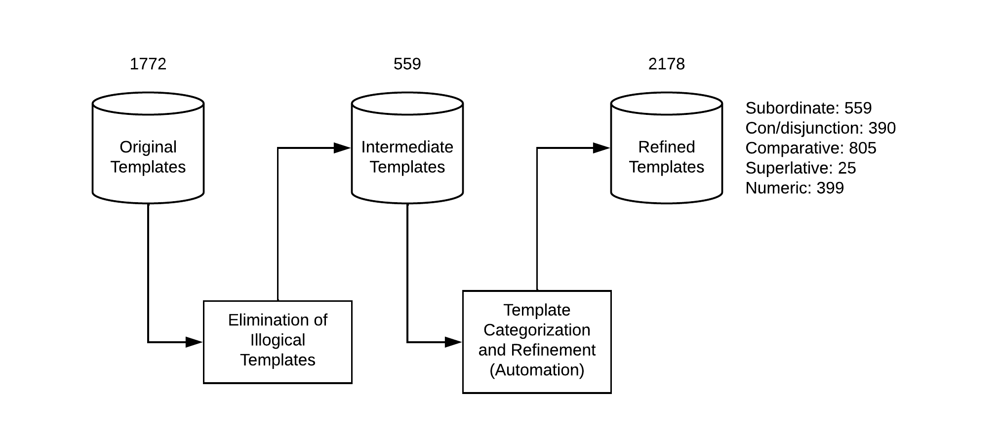

# Week 3

---

A simple overview of size of the database in terms of templates after each step is represented in the figure below:

## Template Refinement (Automation)

The resultant refined templates and their respective transformed SPARQL queries of each class are displayed in the below tables separately. These templates are more natural and varied compared to the original basic templates.

### Subordinate

| template        | SPARQL | Refined template   | Transformed SPARQL |
|:-------------|:------------------|:-------------|:------------------|
| What is the parent of \<A> ? | select ?x where { \<A> dbo:parent ?x } | What is the parent of \<A> ? | select ?x where { \<A> dbo:parent ?x } |
| What is the official school colour of university of \<A> ? | select ?x where { \<A> dbo:university ?x1 . ?x1 dbo:officialSchoolColour ?x } | What is the official school colour of \<A>'s university ?  | select ?x where { \<A> dbo:university ?x1 . ?x1 dbo:officialSchoolColour ?x } |

### Con/disjunction

| template        | SPARQL | Refined template   | Transformed SPARQL |
|:-------------|:------------------|:-------------|:------------------|
| What is the alma mater of \<A> ? | select ?x where { \<A> dbo:almaMater ?x } | What is the alma mater of \<A> and \<B> ? | select ?x where { ?x dbo:almaMater \<A> . ?x dbo:almaMater \<B> } |
| What is the predecessor of \<A> ? | select ?x where { \<A> dbo:predecessor ?x } | What is the predecessor of \<A> as well as \<B> ? | select ?x where { ?x dbo:predecessor \<A> . ?x dbo:predecessor \<B> } |

### Comparative

| template        | SPARQL | Refined template   | Transformed SPARQL |
|:-------------|:------------------|:-------------|:------------------|
| What is the child of \<A> ? | select ?x where { \<A> dbo:child ?x } | Did \<A> have child ? | ask where { \<A> dbo:child ?x } |
| What is the child of \<A> ? | select ?x where { \<A> dbo:child ?x } | Is \<A> child of \<B> ? | ask where { \<B> dbo:child \<A> } |
| What is the number of students of highschool of \<A> ? | select ?x where { \<A> dbo:highschool ?x1 . ?x1 dbo:numberOfStudents ?x } | Give me all highschool of \<A> with less than 50 number of students ? | select ?x where { ?x1 dbo:highschool \<A> . ?x1 dbo:numberOfStudents ?x filter ( ?x < 50 ) } |

### Superlative

| template        | SPARQL | Refined template   | Transformed SPARQL |
|:-------------|:------------------|:-------------|:------------------|
| What is the wins of owner of \<A> ? | select ?x where { \<A> dbo:owner ?x1 . ?x1 dbo:wins ?x } | What is the lowest wins of owner of \<A> ? | select ?x where { \<A> dbo:owner ?x1 . ?x1 dbo:wins ?x } order by asc(?x) limit 1 |
| What is the number of undergraduate students of university of \<A> ? | select ?x where { \<A> dbo:university ?x1 . ?x1 dbo:numberOfUndergraduateStudents ?x } | What is the highest number of undergraduate students of university of \<A> ? | select ?x where { \<A> dbo:university ?x1 . ?x1 dbo:numberOfUndergraduateStudents ?x } order by desc(?x) limit 1 |

### Numeric

| template        | SPARQL | Refined template   | Transformed SPARQL |
|:-------------|:------------------|:-------------|:------------------|
| What is the population total of \<A> ? | select ?x where { \<A> dbo:populationTotal ?x } | How much is the population total of \<A> ? | select ?x where { \<A> dbo:populationTotal ?x } | 
| What is the child of \<A> ? | select ?x where { \<A> dbo:child ?x } | How many child did \<A> have ? | select count(*) as ?x where { \<A> dbo:child ?x } |

## Template Refinement (Manual)

We intend to refine templates using automated methods i.e no manual interference. Hence, the refine templates (manual) step although carried out by me will not be included in the process of template discovery. 

## Generator

The existing dataset generator that produces data.en and data.sparql file produces data using only a single entity placeholder. But as seen in above tables, there are multiple entities, hence work was carried to incorporate multiple entities. The second entity value was filled using a random function from existing set of entities.

## Benchmark 2

As the template refinement (manual) step was discarded, another method will have to be discussed to further refine the templates and make them even more natural. 

## Next weeks plan:

1. In my opinion, the model needed to be improved as it was not able to translate correctly if the entities are not present or present but in small numbers, and the QALD dataset contains entites which are hardly present in the training dataset. But with some discussion with Tommaso, he advised me to focus on template discovery part and not on the model. Hence, in the next meeting we will discuss further steps of template discovery and tasks that will be performed in the following weeks.
