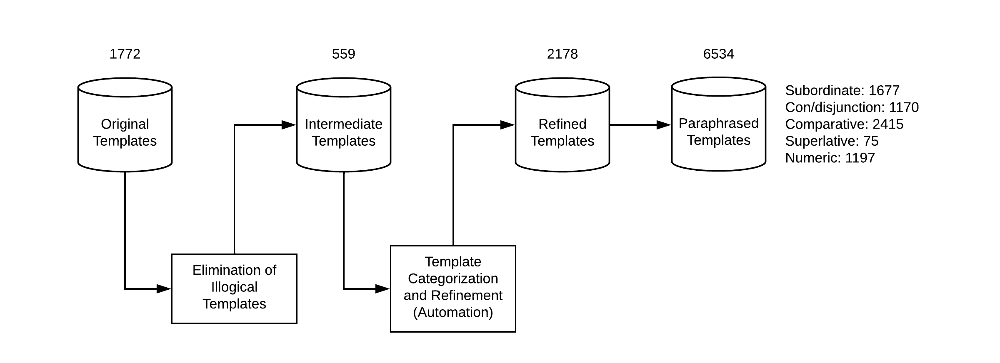
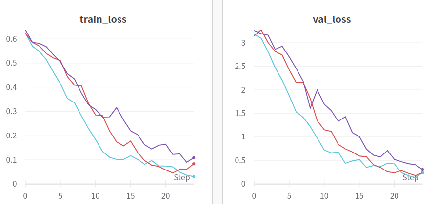
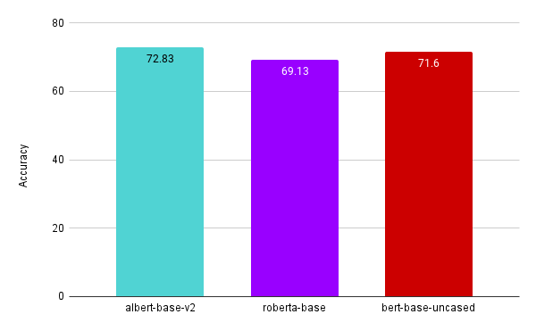

# Week 4

---

A simple overview of size of the database in terms of templates after each step is represented in the figure below:



## Paraphraser

After a series of steps in the process of template discovery, the next step is to make the templates more natural using a  paraphraser. The T5 paraphraser is used and the technique using which the templates are paraphrased is found in Zheyuan's blog. A few examples of paraphrased templates of each class are presented below:

### Subordinate
<div class="code-example" markdown="1">

|    template            | refined template        | paraphrased template   | 
|:-------------|:------------------|:------------------|
| What is the birth name of \<A> ?  | What is the birth name of \<A> ?  | What is the name of \<A> ? |
| What is the birthplace of \<A> ? | What is the birthplace of \<A> ?   | Where is \<A> born ? |
| What is the height of \<A> ?  | What is the height of \<A> ?  | How tall is \<A> ? |
| What is the population total of \<A> ? | What is the population total of \<A> ? | What is total population in \<A> ? | 
| Who is the auteur of \<A> ?  | Who is the auteur of \<A> ? | Who is \<A> author ? | 

</div>

### Con/disjunction
<div class="code-example" markdown="1">

|    template            | refined template        | paraphrased template   | 
|:-------------|:------------------|:------------------|
| What is the parent of \<A> ?  | What is the parent of \<A> as well as \<B> ?  | Who is the parent of \<B> and \<A> ? |
| What is the city of \<A> ? | What is the city of \<A> and \<B> ?   | What's the city of \<A> and \<B> ? |
| What is the location of \<A> ?  | What is the location of \<A> as well as \<B> ?  | Where are \<A> and \<B> located ? |
| What is the mayor of \<A> ? | What is the mayor of \<A> as well as \<B> ? | Who is the mayor of \<A> and \<B> ? | 
| Who is the auteur of \<A> ?  | Who is the auteur of \<A> and \<B> ? | Who are the authors of \<A> and \<B> ? | 

</div>

### Comparative
<div class="code-example" markdown="1">

|    template            | refined template        | paraphrased template   | 
|:-------------|:------------------|:------------------|
| What is the child of \<A> ?  | Did \<A> have child ?  | Has \<A> had a child ? |
| What is the active years start year of \<A> ? | Did \<A> have active years start year ?   | Was \<A> active during his start year ? |
| What is the starring of \<A> ? | Is \<A> starring of \<B> ?  | Is \<A> starring in \<B> or not ? |
| What is the employer of \<A> ? | Did \<A> have employer ? | Did \<A> have an employer ? | 
| What is the team of \<A> ? | Did \<A> have team ?  | Did \<A> ever have a team ? | 

</div>

### Superlative
<div class="code-example" markdown="1">

|    template            | refined template        | paraphrased template   | 
|:-------------|:------------------|:------------------|
| What is the number of episodes of show of \<A> ? | What is the smallest number of episodes of show of \<A> ?  | What is the smallest number of episodes of \<A> ? |
| What is the number sold of sales of \<A> ? | What is the highest number sold of sales of \<A> ?  | What is the highest number of sales for \<A> company ? |
| What is the number of students of highschool of \<A> ? | What is the highest number of students of highschool of \<A> ? | What's the highest number of students in high school \<A> ? |

</div>

### Numeric
<div class="code-example" markdown="1">

|    template            | refined template        | paraphrased template   | 
|:-------------|:------------------|:------------------|
| What is the child of \<A> ?  | How many child did \<A> have ?  | How many children did \<A> have ? |
| What is the employer of \<A> ? | How many employer did \<A> have ?  | How many employers does \<A> have ? |
| What is the influenced by \<A> ? | How many influenced by did \<A> have ?  | How many people were influenced by \<A> in your life ? |
| What is the notable work of \<A> ? | How many notable work did \<A> have ? | How many noteworthy works did \<A> have ? | 
| What is the population total of \<A> ? | How much is the population total of \<A> ? | What are the total inhabitants of \<A> ? | 

## Classification

The paraphraser generates multiple candidates as output. Out of all the candidates, only 2 candidates are added to the template dataset. The first candidate is selected using the formula:

```
score = 0.05*(wd + td) + cos
```

The second method is a transformer model built to classify which sentence out of all the candidates is more natural and similar to the original sentence. The training data is manually annotated and can be found [paraphraser-classifier-train](https://docs.google.com/document/d/1on4Cyxgq2EiwpebjvziNwPAoZpYjSsZENQ-bTZCtfiU). This data was further annotated from where it was left off by Zheyuan using refined templates. The classes involved are -1, 0, and 1 with 1 being the most similar. The formula used for evaluation is:

```
score = 0.05*(wd + td) + cos + pred_labels[i]
```

'wd', and 'td' stands for words distance and tags distance. A more detailed information can be found in the [blog](https://baiblanc.github.io/2020/08/03/GSOC-Week-Nine/)

Three transformer models were built to determine which model performs the best on the test set namely: albert-base-v2, bert-base-uncased, and roberta-base. Some of the training, validation, and test results are shown below:





As the test accuracy of albert-base-v2 was the highest, it was used for classification.
