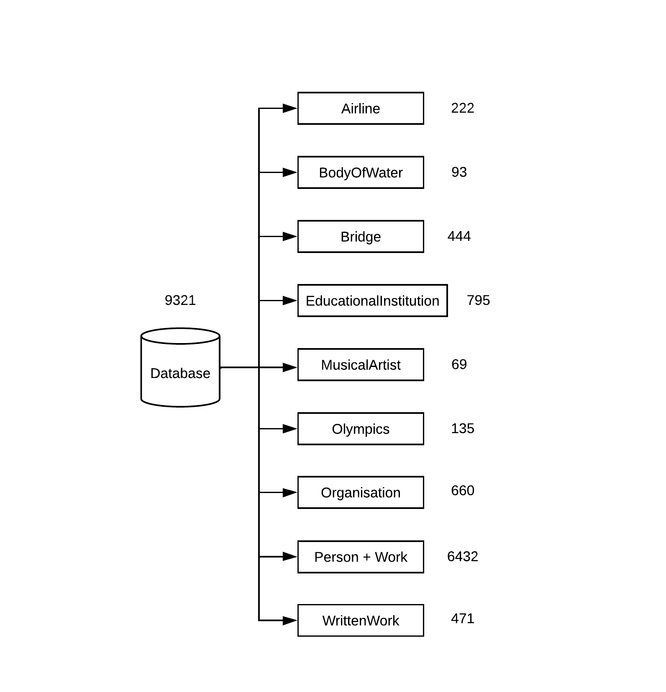

# Week 5

---

The templates of some random ontology classes besides Person and Work are tested using our pipeline structure of template discovery. The categorization rules of some classes i.e numeric and superlative to categorize the templates were modified. The size of the dataset after paraphrasing and a few examples of each ontology class is displayed below:

### Airline

|    template            | refined template        | paraphrased template   | 
|:-------------|:------------------|:------------------|
| What is the target airport of \<A> ? | What is the target airport of \<A> ? | What is the \<A>'s target airport ? |
| What is the number of vehicles in \<A> ? | What is the number of vehicles in \<A> as well as \<B> ?   | What is the number of vehicles in both \<B> and \<A> ? |
| What is the number of vehicles in \<A> ? | Did \<A> have number of vehicles ? | Did \<A> have many vehicles ? | 
| What is the National Topographic System map number of destination of \<A> ? | What is the smallest National Topographic System map number of destination of \<A> ?  | What is the smallest National Topographic System map number for \<A> ? |
| What is the target airport of \<A> ? | How many target airport did \<A> have ? | How many target airports did \<A> have ? | 

### BodyOfWater

|    template            | refined template        | paraphrased template   | 
|:-------------|:------------------|:------------------|
| What is the \<A> inflow ? | What is the \<A> and \<B> inflow ?  | What are \<A> and \<B> inflows ? |
| What is the \<A> outflow ? | Did \<A> have outflow ? | Did \<A> have an outflow ? | 
| What is the shore length of \<A> ? | How much is the shore length of \<A> ? | How long is the shoreline of \<A> ? | 

### Bridge

|    template            | refined template        | paraphrased template   | 
|:-------------|:------------------|:------------------|
| What is the track length of \<A> ? | What is the track length of \<A> ? | How long is the \<A> track ? |
| What is the vehicles per day of \<A> ? | What is the vehicles per day of \<A> and \<B> ?   | How many vehicles are in \<A> and \<B> per day ? |
| What is the bridge carries of \<A> ? | Did \<A> have bridge carries ? | Did \<A> carry a bridge ? | 
| What is the number of lanes of \<A> ? | How much is the number of lanes of \<A> ? | How much is \<A>'s number of lanes ? | 

### EducationalInstitution

|    template            | refined template        | paraphrased template   | 
|:-------------|:------------------|:------------------|
| When is the formation date of child organisation of \<A> ? | When is the formation date of \<A>'s child organisation ? | When is \<A>'s child organisation formed ? |
| What is the number of employees of \<A> ? | What is the number of employees of \<A> as well as \<B> ?  | How many employees are employed in both \<B> and \<A> ? |
| Who is the chief executive officer of \<A> ? | Did \<A> have chief executive officer ? | Are there any instances of \<A> having chief executive officer ? | 
| Who is the alumni of \<A> ? | How many alumni did \<A> have ? | How many alumni of \<A> have there been ? | 

### MusicalArtist

|    template            | refined template        | paraphrased template   | 
|:-------------|:------------------|:------------------|
| What is the instrument of \<A> ? | What is the instrument of \<A> ? | What are instruments of \<A> ? |
| What is the movement of \<A> ? | What is the movement of \<A> as well as \<B> ? | What are the movements of the \<B> and \<A> ? |
| What is the training of \<A> ? | Did \<A> have training ? | Was \<A> training ? | 
| What is the training of \<A> ? | How many training did \<A> have ? | How many instructors did \<A> have in its training program ? | 

### Olympics

|    template            | refined template        | paraphrased template   | 
|:-------------|:------------------|:------------------|
| Who is the champion in mixed double of \<A> ? | Who is the champion in mixed double of \<A> ? | Who is the winner in \<A> Mixed Double ? |
| What is the bronze medalist of \<A> ? | What is the bronze medalist of \<A> and \<B> ? | Who are the two bronze medalists of \<A> and \<B> ? |
| Who is the champion of \<A> ? | Did \<A> have champion ? | Did \<A> really have a champion ? | 
| Who is the champion in mixed double of \<A> ? | How many champion in mixed double did \<A> have ? | How many champions did \<A> have in the mixed double ? | 

### Organisation

|    template            | refined template        | paraphrased template   | 
|:-------------|:------------------|:------------------|
| Who is the chairperson of \<A> ? | Who is the chairperson of \<A> ? | Who is the chairman of \<A> ? |
| Who is the administrator of \<A> ? | Who is the administrator of \<A> as well as \<B> ? | Who controls \<B> and \<A> ? |
| Who is the secretary of \<A> ? | Did \<A> have secretary ? | Did \<A> ever have a secretary or secretaries ? | 
| When is the formation date of child organisation of \<A> ? | When is the oldest formation date of child organisation of \<A> ? | When did the Children's Organisation of \<A> become started ? | 
| What is the number of employees of \<A> ? | How much is the number of employees of \<A> ? | How much employees do \<A> have ? | 

### WrittenWork

|    template            | refined template        | paraphrased template   | 
|:-------------|:------------------|:------------------|
| Who is the author of \<A> ? | Who is the author of \<A> ? | Who wrote \<A> ? |
| What is the starring of \<A> ? | What is the starring of \<A> as well as \<B> ? | What are the famous stars of \<A> and \<B> as well as \<B> ? |
| What is the starring of \<A> ? | Did \<A> have starring ? | Did \<A> have actors ? | 
| What is the based on of \<A> ? | How many based on did \<A> have ? | How many if any of the \<A> stars were based on ? | 

Each of the above ontology classes including Person, and Work contains templates, and paraphrased templates that don't make much sense. Randomly, some of them are displayed below:

|    template            | refined template        | paraphrased template   | 
|:-------------|:------------------|:------------------|
| What is the hub airport of \<A> ? | What is the hub airport of \<A> as well as \<B> ? | Is \<A> a hub airport in \<B> ? |
| What is the \<A> outflow ? | Did \<A> have outflow ? | Why did \<A> ever have an outflow ? |
| What is the rail gauge of \<A> ? | What is the rail gauge of \<A> ? | How is the Gauge of rail of \<A> calculated ? |
| Who is the dean of \<A> ? | How many dean did \<A> have ? | How many dean do they have ? |
| What is the merged with of \<A> ? | What is the merged with of \<A> as well as \<B> ? | Where exactly is \<B> and \<A> ? |
| What is the movement of \<A> ? | What is the movement of \<A> ? | What is the movement of \<A> in the solar system ? |
| Who is the gold medalist of \<A> ? | How many gold medalist did \<A> have ? | How many gold medals were \<A> given and in what year ? |
| Who is the gold medalist of \<A> ? | Is \<A> gold medalist of \<B> ? | Is \<A>, a five-time \<B> gold medalist ? |
| What is the location city of \<A> ? | How many location city did \<A> have ? | How many locations on \<A> did YYZ have ? |
| What is the based on of based on of \<A> ? | What is the based on of based on of \<A> as well as \<B> ? | What does \<A>, \<B>, and \<A> mean ? |

