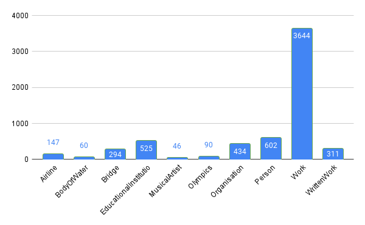
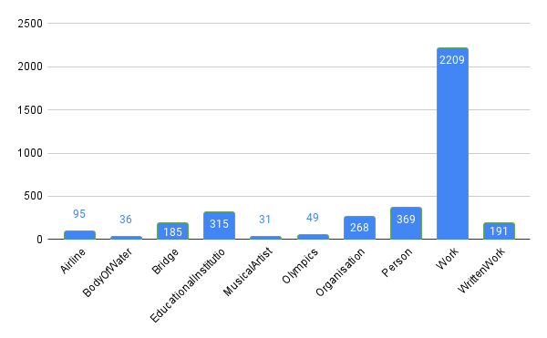

# Week 6

---

## Elimination of Illogical Templates

As presented in previous weeks blog, each ontology class contains templates that don't make much sense. As the number of such templates is significant, they need to be eliminated. The refined and paraphrased templates were paired together i.e (pair1 - refined + paraphrase1, pair2 - refined + paraphrase2). The initial count of templates in each class is displayed below.



1.<b> Similarity </b> - In this method, embeddings are extracted of all the texts, then cosine similarity between all the pairs is calculated. A threshold is set and only those pairs are kept that have similarity value higher than the threshold. Setting threshold value - 0.90 and data taken from previous weeks blog i.e displayed in tables (approx 33 good templates and 10 illogical templates) - as a result 30% of the good templates get eliminated and 80% of the illogical templates get eliminated. Also the result dataset size reduces quite evenly for all the ontologies as shown below:



Few examples of templates that fall above and below the threshold are presented below:

<div class="code-example" markdown="1">

|    refined template            | paraphrased template        | score   | 
|:-------------|:------------------|:------------------|
| What is \<A>'s revenue ? | What's \<A>'s revenue ? | 0.9983 |
| What is the number of students of \<A> and \<B> ? | How many students are there in \<B> and \<A> ? | 0.9734 |
| What is the length of \<A> and \<B> ? | How long is \<B> and \<A> ? | 0.9568 |
| How many spouse did \<A> have ? | How many wife did \<A> have ? | 0.9224 |
| How many album did \<A> have ? | How many albums do you think the artist \<A> have ? | 0.9125 |

</div>

<div class="code-example" markdown="1">

|    refined template            | paraphrased template        | score   | 
|:-------------|:------------------|:------------------|
| What is the origin of \<A>'s founded by ? | What is \<A>'s origin ? | 0.8947 |
| What is the sound recording of \<A> and \<B> ? | How do I record the sound of \<A> \<B> and \<A> ? | 0.8778 |
| Is \<A> anthem of \<B> ? | Is the anthem \<A> the latest classic of \<B> ? | 0.8471 |
| What is the state of \<A> ? | What is the state of the universe of \<A> ? | 0.8037 |
| How many location city did \<A> have ? | How many locations on \<A> did YYZ have ? | 0.7026 |

</div>

2.<b> Commonsense Understanding </b> - The goal of this method is to identify which of the two sentences makes sense. In our case, even after elimination of templates that don't make sense using the similarity technique, there might be some pairs in which paraphrased templates don't make sense. Hence in that case the idea is to select the refined template instead of the paraphrased template. Out of all the research papers I referred to in this domain, the [Does It Make Sense? And Why? A Pilot Study for Sense Making and Explanation](https://arxiv.org/pdf/1906.00363.pdf) addresses the same issue. [SemEval-2020 Task 4: Commonsense Validation and Explanation](https://arxiv.org/pdf/2007.00236.pdf) states that:
```
In this paper, we present SemEval-2020 Task 4, Commonsense Validation and Explanation
(ComVE), which includes three subtasks, aiming to evaluate whether a system can distinguish a
natural language statement that makes sense to humans from one that does not, and provide the
reasons. Specifically, in our first subtask, the participating systems are required to choose from two
natural language statements of similar wording the one that makes sense and the one does not.
```

