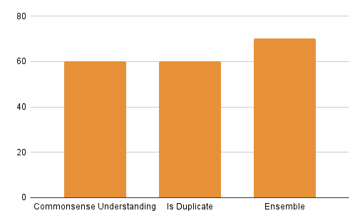

# Week 7

---

After initial elimination of illogical paraphrased templates, this week I focused on implementing methods that can help us predict which template to select i.e refined or paraphrased because there might be certain paraphrased templates in the dataset (after elimination) that are not quite efficient. 

1.<b> Commonsense Understanding </b> - A classification model was built to classify a template as against commonsense or not. If the template was against commonsense, then it was not selected i.e in our case if the predicted value was 0 (refined) then 1 (paraphrased) would be selected. A sample training dataset sample is displayed below:

|   refined           | paraphrased        | value ( 0 - refined is against commonsense, 1 - paraphrased is against commonsense)  | 
|:-------------|:------------------|:------------------|
| He poured orange juice on his cereal. | He poured milk on his cereal. | 0 |
| He drinks apple. | He drinks milk. | 0 |
| Jeff ran a mile today | "Jeff ran 100,000 miles today" | 1 |
| A mosquito stings me | I sting a mosquito | 1 |
| A niece is a person. | A giraffe is a person. | 1 |

A testset of 20 templates was created to test this method because the training sample although performing the same idea i.e against commonsense classification, didn't have domain specific templates as ours plus these sentences in training data are not questions, these are statements. We achieved a test accuracy of 60%. Few results from the testset are displayed below:

|   refined           | paraphrased        | true value   | predicted value |
|:-------------|:------------------|:------------------|
| What is the length of \<A> and \<B> ? | How long is \<B> and \<A> ? | 0 | 0 |
| Is \<A> death cause of \<B> ? | Is death cause of \<A> with \<B> ? | 1 | 1 |
| What is the instrument of \<A> ? | What are instruments of \<A> ? | 0 | 0 |
| What is the victim of \<A> ? | Is there the victim of \<A> ? | 1 | 1 |
| Is \<A> denomination of \<B> ? | What is \<A> denomination of \<B>/\<B> ? | 1 | 0 |

2.<b> Is duplicate method </b> - [Quora Question Pairs dataset](https://www.kaggle.com/datasets/quora/question-pairs-dataset) was utilized to identify whether the refined template and paraphrased template were duplicate of each other or not. If they were duplicate (1) then paraphrased template would be used else refined template because if they weren't similar semantically then the nlq template would change while the sparql query would remain the same. A sample training dataset sample is displayed below:

|   refined           | paraphrased        | value ( 0 - not duplicate, 1 - is duplicate) | 
|:-------------|:------------------|:------------------|
| What is the step by step guide to invest in share market in india? | What is the step by step guide to invest in share market? | 0 |
| How can I be a good geologist | What should I do to be a great geologist? | 1 |
| What does manipulation mean? | What does manipulation means? | 1 |
| What are some good rap songs to dance to? | What are some of the best rap songs? | 0 |
| What is the best book ever made? | What is the most important book you have ever read? | 1 |

A testset of 20 templates was created to test this method because the training sample although performing the same idea i.e is duplicate, didn't have domain specific templates as ours but atleast these sentences in training data were questions. We achieved a test accuracy of 60%. Few results from the testset are displayed below:

|   refined           | paraphrased        | true value   | predicted value |
|:-------------|:------------------|:------------------|
| What is the length of \<A> and \<B> ? | How long is \<B> and \<A> ? | 1 | 0 |
| Is \<A> death cause of \<B> ? | Is death cause of \<A> with \<B> ? | 0 | 0 |
| What is the instrument of \<A> ? | What are instruments of \<A> ? | 1 | 1 |
| What is the victim of \<A> ? | Is there the victim of \<A> ? | 0 | 0 |
| Is \<A> denomination of \<B> ? | What is \<A> denomination of \<B>/\<B> ? | 0 | 1 |

3.<b> Ensemble </b> - When the outputs from both the above techniques were combined to select the final result, the accuracy of the final outcome increases significantly. For example:

| refined | paraphrased | True value | Method1 Prediction | Method2 Prediction|
|:------------------|:------------------|:------------------|:------------------|
| What is \<A>'s revenue ? | What's \<A>'s revenue ?| paraphrased | Correct | Correct |
| What is the length of \<A> and \<B> ? | How long is \<B> and \<A> ? | paraphrased | Correct | Incorrect |
| How many dam did \<A> have ? | How many dam was \<A> ?| refined | Correct | Correct |
| Did \<A> have number of vehicles ? | Did \<A> have many vehicles ? | paraphrased | Correct | Correct |
| Is \<A> death cause of \<B> ? | Is death cause of \<A> with \<B> ? | refined | Correct | Correct |
| Is \<A> birth year of \<B> ? | Is \<A> as \<B>'s birth year ? | refined | Incorrect | Incorrect |
| How many alumni did \<A> have ? | How many alumni of \<A> have there been ? | paraphrased | Correct | Incorrect |
| Did \<A> have training ? | Was \<A> training ? | paraphrased | Correct | Incorrect |
| Is \<A> series of \<B> ? | Is \<A> the \<A> series of \<B> ?  | refined | Incorrect | Incorrect |
| How much is the shore length of \<A> ? | How long is the shoreline of \<A> ? | paraphrased | Correct | Correct |
| Is \<A> pronunciation of \<B> ? | How \<A> pronunciation of \<B> is used ? | refined | Incorrect | Incorrect |
| When is the formation date of \<A>'s child organisation ? | When is \<A>'s child organisation formed ? | paraphrased | Incorrect | Correct |
| Did \<A> have sire ? | Did \<A> have a sire in \<A> ? | refined | Correct | Correct |
| Is \<A> denomination of \<B> ? | What is \<A> denomination of \<B>/<B> ? | refined | Incorrect | Incorrect |
| What is the instrument of \<A> ? | What are instruments of \<A> ? | paraphrased | Correct | Correct |
| Is \<A> destination of \<B> ? | What is \<A> destination of \<B> ? | refined | Incorrect | Correct |
| How much is the number of employees of \<A> ? | How much employees do \<A> have ? | paraphrased | Correct | Incorrect |
| Who is the author of \<A> ? |  Who wrote \<A> ? | paraphrased | Incorrect | Correct |
| What is the victim of \<A> ? | Is there the victim of \<A> ? | refined | Correct | Correct |
| Is \<A> date of abandonment of \<B> ? | When did \<B> abandon \<A> ? | refined | Incorrect | Correct |

As you can see from above, the individual accuracies are 60% each but after analysis it is found out that the method predicting paraphrased template as the correct template is better than the method predicting refined template for the same sentence. Hence in those cases - Correct, Incorrect or Incorrect, Correct where there is conflict between both the methods, method which predicts paraphrased template will be chosen. Using this strategy the accuracy reaches 70%.

This technique would help us select the best template i.e between refined and paraphrased template and make the final dataset as efficient as possible.