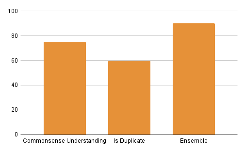
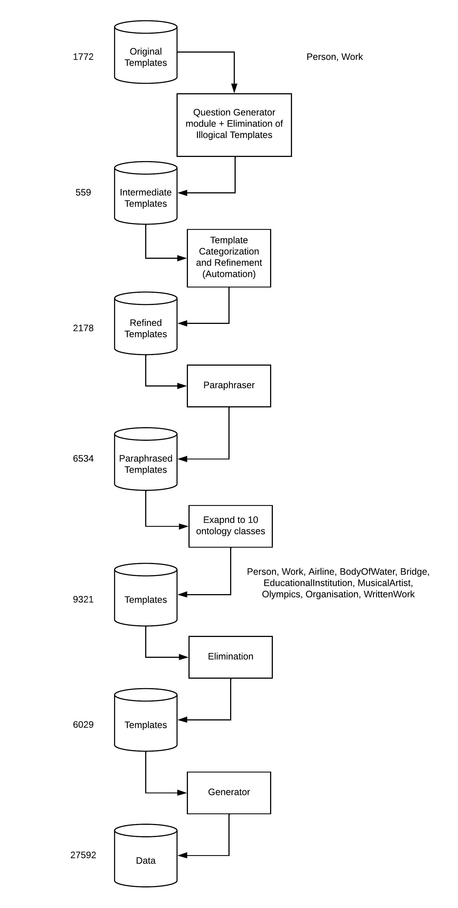

# Week 8

---

In order to further improve the accuracy for selecting either the refined or paraphrased template, we substituted '\<A>' by '\<X>' because it was quite possible that the language models were interpreting '\<A>' as 'a' and hence that changes the entire meaning of the sentence. Replacing '\<A>' with '\<X>' improved the accuracy of the commonsense task from 60% to 75%, accuracy remained same in Quora question pairs task at 60%, and the accuracy increased significantly during ensemble from 70% to 90%.

| refined | paraphrased | True value | Method1 Prediction | Method2 Prediction|
|:------------------|:------------------|:------------------|:------------------|
| What is \<A>'s revenue ? | What's \<A>'s revenue ?| paraphrased | Correct | Correct |
| What is the length of \<A> and \<B> ? | How long is \<B> and \<A> ? | paraphrased | Incorrect | Incorrect |
| How many dam did \<A> have ? | How many dam was \<A> ?| refined | Correct | Correct |
| Did \<A> have number of vehicles ? | Did \<A> have many vehicles ? | paraphrased | Correct | Correct |
| Is \<A> death cause of \<B> ? | Is death cause of \<A> with \<B> ? | refined | Correct | Incorrect |
| Is \<A> birth year of \<B> ? | Is \<A> as \<B>'s birth year ? | refined | Incorrect | Incorrect |
| How many alumni did \<A> have ? | How many alumni of \<A> have there been ? | paraphrased | Correct | Incorrect |
| Did \<A> have training ? | Was \<A> training ? | paraphrased | Correct | Incorrect |
| Is \<A> series of \<B> ? | Is \<A> the \<A> series of \<B> ?  | refined | Incorrect | Incorrect |
| How much is the shore length of \<A> ? | How long is the shoreline of \<A> ? | paraphrased | Correct | Correct |
| Is \<A> pronunciation of \<B> ? | How \<A> pronunciation of \<B> is used ? | refined | Correct | Correct |
| When is the formation date of \<A>'s child organisation ? | When is \<A>'s child organisation formed ? | paraphrased | Incorrect | Correct |
| Did \<A> have sire ? | Did \<A> have a sire in \<A> ? | refined | Correct | Correct |
| Is \<A> denomination of \<B> ? | What is \<A> denomination of \<B>/\<B> ? | refined | Incorrect | Incorrect |
| What is the instrument of \<A> ? | What are instruments of \<A> ? | paraphrased | Correct | Correct |
| Is \<A> destination of \<B> ? | What is \<A> destination of \<B> ? | refined | Correct | Correct |
| How much is the number of employees of \<A> ? | How much employees do \<A> have ? | paraphrased | Correct | Incorrect |
| Who is the author of \<A> ? |  Who wrote \<A> ? | paraphrased | Correct | Correct |
| What is the victim of \<A> ? | Is there the victim of \<A> ? | refined | Correct | Correct |
| Is \<A> date of abandonment of \<B> ? | When did \<B> abandon \<A> ? | refined | Correct | Correct |

## Generator module

The generator module is responsible for generating the actual dataset where the placeholders present in the templates are replaced by real-world entities. Due to presence of templates containing 2 placeholders which was different from before (1 placeholder), the generator code had to be altered to incorporate the second entity. There were 2 classes which contained 2 placeholders namely - Con/disjunction, and comparative class.

### Con/disjunction

In this class, any real-world entity would work. Hence, the second entity would be one selected randomly from the result of the expanded sparql generator query i.e the same way in which the first entity was selected.

| nlq        | SPARQL | 
|:-------------|:------------------|
| What's the closing date of vlm airlines and oasis leisure centre ? | select ?x where { dbr:VLM_Airlines dbo:closingDate ?x . dbr:Oasis_Leisure_Centre dbo:closingDate ?x } |
| What is the number of lines of toulouse metro as well as poma 2000 ? | select ?x where { dbr:Toulouse_Metro dbo:numberOfLines ?x . dbr:Poma_2000 dbo:numberOfLines ?x } |

### Comparative

Here, as the output of the sparql query is true or false, entites needed to be selected strategically otherwise if selected randomly using the above approach the result would be false most of the times. Hence, a script was written to manipulate the original query using the first entity, fetch the correct answer, and substitute it with the second placeholder. In the below samples, clearly the output of sample 1 is true and 2 is false. 

| nlq        | SPARQL | 
|:-------------|:------------------|
| Is 1985-06-04 birth date of bar refaeli ? | ask where { dbr:Bar_Refaeli dbo:birthDate "1985-06-04"^^xsd:dateTime } |
| Is miriam david birth date of bar refaeli ? | ask where { dbr:Bar_Refaeli dbo:birthDate dbr:Miriam_David } |

## Template Discovery Pipeline

## Dataset

Few examples from the dataset are presented below:

| nlq        | SPARQL | 
|:-------------|:------------------|
| Who was the Prime Minister of ștefan ciobanu ? | select ?x where { dbr:Ștefan_Ciobanu dbo:primeMinister ?x } |
| What is the significant project of vojteh ravnikar and will alsop ? | select ?x where { dbr:Vojteh_Ravnikar dbo:significantProject ?x . dbr:Will_Alsop dbo:significantProject ?x } |
| Did acorn electron have CPU ? | ask where { dbr:Acorn_Electron dbo:cpu ?x } |
| Is 1985-06-04 birth date of bar refaeli ? | ask where { dbr:Bar_Refaeli dbo:birthDate "1985-06-04"^^xsd:dateTime } |
| Give me all highschool of willie burden with less than 50 number of students ? | select ?x where { ?x1 dbo:highschool dbr:Willie_Burden . ?x1 dbo:numberOfStudents ?x filter ( ?x < 50 ) } |
| What is the highest number of students of highschool of corvey irvin ? | select ?x where { dbr:Corvey_Irvin dbo:highschool ?x1 . ?x1 dbo:numberOfStudents ?x } order by desc(?x) limit 1 |
| How many children did bette davis have ? | select count(*) as ?x where { dbr:Bette_Davis dbo:child ?x } |
